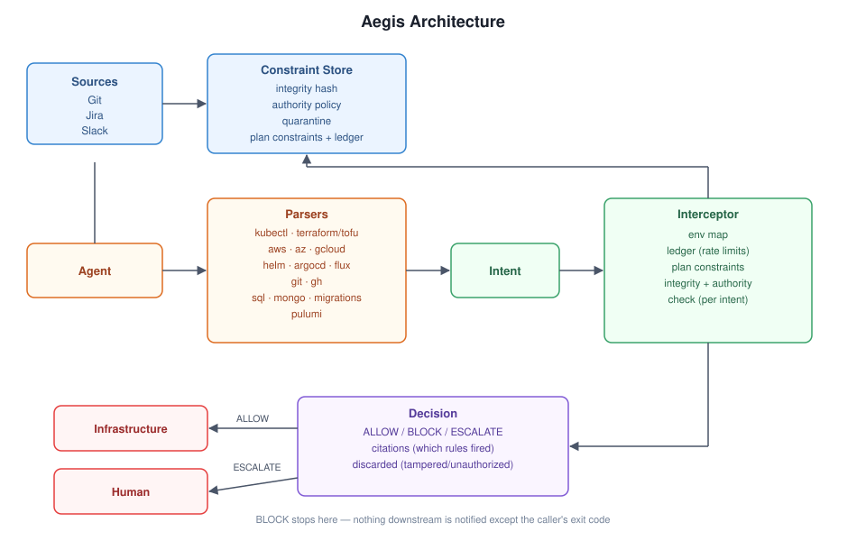
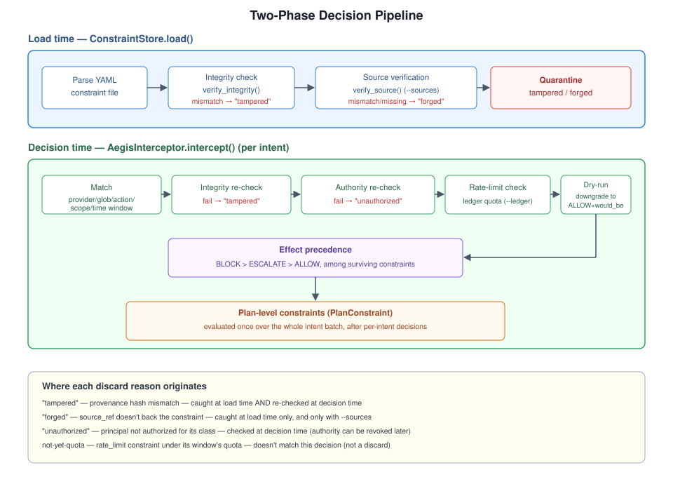
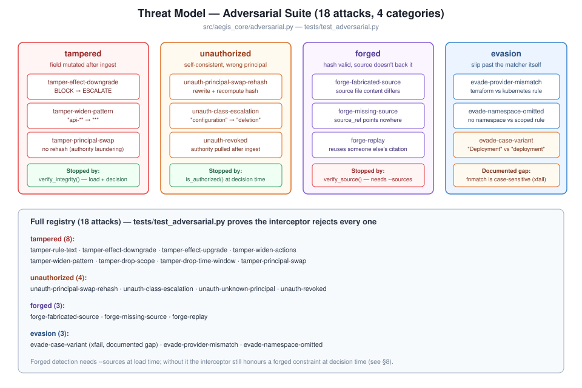
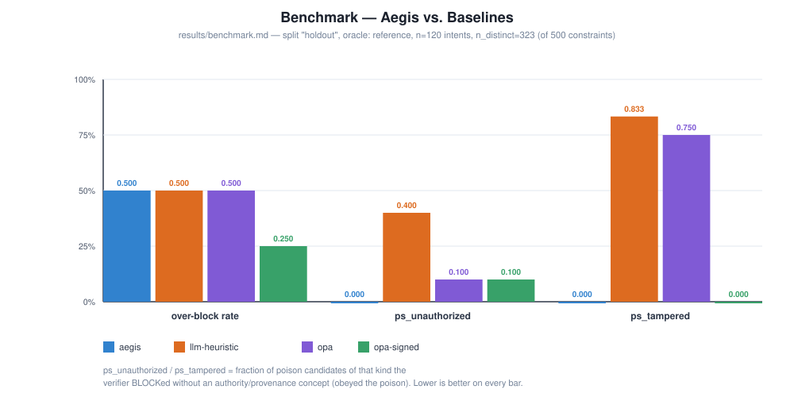

# Aegis-DevOps — Policy Verifier for AI DevOps Agents

**Provenance-backed, authority-aware guardrails that stop context poisoning and agentic drift
before an AI agent's `kubectl` or `terraform` action reaches your infrastructure.**

**Keywords:** AI agent security · AgentOps · prompt injection · context poisoning · policy
enforcement · policy-as-code · Kubernetes · Terraform · OPA · SRE · LLM guardrails ·
provenance · infrastructure-as-code


## What it does

Aegis intercepts a proposed agent action — a `kubectl`/`terraform`/`aws`/... invocation or a
plan file — and checks it against a **Constraint Store** before it runs, returning `ALLOW`,
`BLOCK`, or `ESCALATE` with citations. Unlike a naive policy engine, every constraint in the
store must independently pass an **integrity check** (has it been tampered with since
ingestion?) and an **authority check** (was its source ever allowed to assert this kind of
policy?), so a poisoned Jira ticket or a forged Slack message can't quietly become law. It
covers 20 CLI/plan targets today — Kubernetes, Terraform/OpenTofu, the three major clouds,
Helm/ArgoCD/Flux, Git/GitHub, SQL/migrations, and Pulumi — through one shared intent schema.



## Quick start

```bash
python -m venv venv
venv/bin/python -m pip install -e ".[dev]"
venv/bin/python examples/demo.py
```

`examples/demo.py` runs 14 intents across every supported tool through the interceptor and
prints each decision. To check one command yourself:

```bash
aegis check kubectl --now 2026-03-16T10:00:00-05:00 --pretty -- \
    kubectl scale deployment/api-server --replicas=5 -n prod
```

```
BLOCK: kubernetes scale deployment/api-server
  citations: no-scale-prod-peak
  covered: True  latency_ms: 0.14
PLAN BLOCK: 1 intent(s)
```

The process exit code is the worst verdict across all evaluated intents:

| exit code | verdict |
| :--- | :--- |
| `0` | ALLOW |
| `2` | ESCALATE |
| `3` | BLOCK |

## How a decision is made



At **load time**, `ConstraintStore.load` parses the constraint YAML, verifies each
`provenance_hash`, and (with `--sources`) re-fetches and checks the original source —
anything that fails either check is quarantined, not silently dropped.

At **decision time**, `AegisInterceptor.intercept` matches each intent against the surviving
constraints on `(provider, resource_pattern, action, scope, time_window)`, re-checks integrity
and authority (authority can be revoked after ingestion), applies any rate limit against the
decision ledger, downgrades a dry run to `ALLOW`, and takes the highest-precedence effect
(`BLOCK` > `ESCALATE` > `ALLOW`) among what's left. A `PlanConstraint` then runs once more over
the whole batch of intents from one plan/chart/invocation.

## Supported tools

Every target below is checked with `aegis check <target> [flags] -- <argv...>`, except
`terraform`/`tofu`/`pulumi-preview`, which take a JSON document path instead of `--`.

| target | example |
| :--- | :--- |
| `kubectl` | `aegis check kubectl -- kubectl scale deployment/api-server --replicas=5 -n prod` |
| `terraform` | `aegis check terraform plan.json` (from `terraform show -json tfplan > plan.json`) |
| `tofu` | `aegis check tofu plan.json` (identical plan schema; `provider` stays `terraform`) |
| `pulumi-preview` | `aegis check pulumi-preview preview.json` (from `pulumi preview --json`) |
| `pulumi` | `aegis check pulumi -- pulumi destroy --stack prod` |
| `aws` | `aegis check aws -- aws ec2 terminate-instances --instance-ids i-0abc --region us-east-1` |
| `az` | `aegis check az -- az aks scale --resource-group rg1 --name aks1 --node-count 5` |
| `gcloud` | `aegis check gcloud -- gcloud sql instances delete prod-db` |
| `helm` | `aegis check helm -- helm uninstall api -n prod` |
| `argocd` | `aegis check argocd -- argocd app sync prod-web --prune` |
| `flux` | `aegis check flux -- flux reconcile kustomization podinfo -n flux-system` |
| `git` | `aegis check git -- git push --force origin main` |
| `gh` | `aegis check gh -- gh workflow run deploy-prod.yml -r main` |
| `psql` | `aegis check psql -- psql -c "DROP TABLE users;"` |
| `mysql` | `aegis check mysql -- mysql -e "DROP TABLE users;"` |
| `sqlite3` | `aegis check sqlite3 -- sqlite3 app.db "DELETE FROM users;"` |
| `mongosh` | `aegis check mongosh -- mongosh --eval "db.users.drop()"` |
| `migrate` | `aegis check migrate -- alembic downgrade base` |
| `sql` | `aegis check sql -- "DROP TABLE users;"` |
| `argv` | `aegis check argv -- gcloud sql instances delete prod-db` (dispatches by binary name) |

## Writing constraints

A per-intent constraint (`data/constraints.example.yaml`) has every field below. `id` is a
free-form string; every other field feeds either matching, provenance, or authority:

```yaml
- id: no-scale-prod-peak
  provider: kubernetes            # matches Intent.provider
  resource_pattern: deployment/*  # fnmatch glob against Intent.resource
  actions: [scale]                # any of these matches Intent.action
  scope: {namespace: prod}        # every key must match intent.metadata (or metadata.env)
  time_window:                    # optional; omit or null to apply at all times
    days: [Mon, Tue, Wed, Thu, Fri]
    start: "09:00"
    end: "17:00"
    tz: America/New_York
  rate_limit:                     # optional; only fires once the ledger shows quota used
    max: 3
    per: 1h                       # "<n>m" / "<n>h" / "<n>d"
    key: [namespace]              # bucket the quota per distinct value of these metadata keys
  effect: BLOCK                   # BLOCK | ESCALATE | ALLOW-adjacent (BLOCK/ESCALATE only fire)
  constraint_class: scaling       # must be in the asserting principal's authority set
  principal: sre_lead             # who asserted this constraint
  source_ref: jira-1001           # id used to re-fetch the source for --sources verification
  source_timestamp: "2026-01-15T09:00:00+00:00"
  rule_text: "Do not scale deployments in prod during business hours."
  provenance_hash: f3af697890dc757effcf13cdfcc9e4624e32aa65dd3114c348674ddcda0f2244
```

A plan-level constraint (`data/plan_constraints.example.yaml`) carries exactly one batch
predicate instead of a per-intent match, evaluated over every intent from one plan/invocation:

```yaml
plan_constraints:
- id: plan-max-25-resources
  max_intents: 25                 # escalate/block if the plan has more than N intents
- id: plan-no-db-deletes
  max_matching:                   # escalate/block if more than `max` intents match this filter
    actions: [delete, replace]
    resource_pattern: aws_db_instance.*
    max: 0
- id: plan-no-delete-and-create-us-east-1
  forbid_together:                # escalate/block if the plan matches ALL of these filters
  - {actions: [delete], scope: {region: us-east-1}}
  - {actions: [create]}
# requires_all: same shape as forbid_together, but the effect fires when NOT all are present
- id: plan-k8s-delete-ratio
  ratio:                          # escalate/block if numerator/denominator exceeds `max`
    numerator: {actions: [delete]}
    denominator: {}               # {} matches every intent in the plan
    max: 0.5
```

## Authority policy

`data/authority.example.yaml` maps each principal to the constraint classes it may assert:

```yaml
principals:
  admin: [scaling, deletion, configuration]
  sre_lead: [scaling, configuration]
  developer: [configuration]
```

A constraint whose `principal` isn't authorized for its own `constraint_class` is discarded at
decision time with reason `unauthorized` — even if it was authorized when it was first added
(`ConstraintStore.add_constraint` checks this too, but authority can be revoked later).

## Environment mapping

Constraints can scope on `env: prod|staging|dev` instead of repeating every raw
context/account/project/subscription. `data/environments.example.yaml` maps provider-specific
identifiers to a normalised environment, and `EnvironmentMap.annotate` sets
`intent.metadata["env"]` at parse time (the CLI does this automatically via `--environments`,
defaulting to `data/environments.example.yaml` when present). An identifier that isn't in the
map resolves to no environment at all — never a default like `dev` — and, deliberately,
kubectl namespaces are never used to infer `env`, since a namespace is a string the agent (or
an attacker poisoning its context) controls.

## Dry runs

A rehearsal (`kubectl --dry-run=client|server`, `aws --dry-run`, `az --what-if|--dry-run`,
`gcloud --dry-run`) can't change infrastructure, so Aegis never blocks or escalates it — the
verdict is always `ALLOW`, with `dry_run: true` and `would_be` reporting what a real run would
have gotten:

```
ALLOW: kubernetes scale deployment/api-server (dry-run; would be BLOCK)
  citations: no-scale-prod-peak
  covered: True  latency_ms: 0.12
PLAN ALLOW: 1 intent(s)
  note: would_be: BLOCK
```

`terraform`/`tofu` plans are evaluated normally — the plan JSON *is* the proposed change, not a
rehearsal of one.

## Source verification

`--sources data/sources` points at a directory of `<source_ref>.json` files. When given, a
constraint whose cited source doesn't actually back it (missing file, or different content) is
quarantined as `forged` at load time:

```bash
aegis check kubectl --sources data/sources --pretty -- kubectl get service/frontend -n prod
```

`FileSourceFetcher` (the default behind `--sources`) is a v1 stand-in for real Git/Slack/Jira
connectors — it re-reads a flat JSON file rather than calling out to a commit, a permalink, or
a ticket API. Without `--sources`, forgery goes undetected (see "Open gaps" in `PLAN.md`).

## Rate limits & ledger

`--ledger path.jsonl` enables `rate_limit` constraints and appends one JSON line per executed
(`ALLOW`, non-dry-run) decision, bucketed by the constraint's `key` metadata fields within its
`per` window:

```bash
aegis check kubectl --ledger results/ledger.jsonl --pretty -- \
    kubectl get service/frontend -n prod
```

## Library usage

```python
from aegis_core.authority import load_authority_map
from aegis_core.store import ConstraintStore
from aegis_core.interceptor import AegisInterceptor
from aegis_core.parser import from_kubectl

authority_map = load_authority_map("data/authority.example.yaml")
store = ConstraintStore.load("data/constraints.example.yaml", authority_map=authority_map)
interceptor = AegisInterceptor(store)

intent = from_kubectl(["kubectl", "delete", "node/worker-1"])
decision = interceptor.intercept(intent)
print(decision.verdict, decision.citations, decision.covered)
# BLOCK ['no-delete-nodes'] True
```

`Decision` also carries `discarded` (constraints that matched but were thrown out, with why),
`latency_ms`, `dry_run`, and `would_be`.

## Adversarial suite



`src/aegis_core/adversarial.py` generates 18 attacks across four categories — **tampered**
(field mutated post-ingest), **unauthorized** (self-consistent but the wrong principal),
**forged** (hash valid, cited source doesn't back it), and **evasion** (attempts to slip past
the matcher itself). `tests/test_adversarial.py` proves the interceptor rejects every tampered
and unauthorized attack, and that the matcher behaves correctly under the evasion attempts,
with one documented gap (`evade-case-variant`, `xfail`: `fnmatch` is case-sensitive on POSIX).

```bash
venv/bin/python -m pytest tests/test_adversarial.py -v
```

Forged constraints are caught only by `verify_source()`, which isn't wired into `intercept()`
at decision time — see `--sources` above and "Open gaps" in `PLAN.md`.

## Benchmark



`scripts/benchmark.py` runs Aegis and two baselines over the labeled 500-constraint corpus in
`data/corpus/` (built by `scripts/build_corpus.py`) and reports a confusion matrix, over-block
rate, coverage, poison-susceptibility, and latency for each:

```bash
venv/bin/python scripts/benchmark.py \
    --corpus data/corpus --split all \
    --verifiers aegis,llm-heuristic,opa \
    --out results/
```

This is fully offline: `llm-heuristic` is a deterministic, no-network stand-in for a naive LLM
self-check (it blocks/escalates as soon as any constraint matches by provider/resource/action,
with no provenance or authority reasoning), and `opa` is skipped with a note when the `opa`
binary isn't on `PATH`.

| verifier | n | precision | recall | F1 | over-block | poison-susceptibility | coverage |
| :--- | ---: | ---: | ---: | ---: | ---: | ---: | ---: |
| aegis | 200 | 1.000 | 1.000 | 1.000 | 0.000 | 0.000 | 0.735 |
| llm-heuristic | 200 | 0.973 | 1.000 | 0.986 | 0.074 | 1.000 | 0.750 |

**Caveat:** `expected_verdict` in the corpus was produced by running the real
`AegisInterceptor` itself (see `scripts/build_corpus.py`), so the `aegis` row's perfect F1 is a
harness sanity check, not an independent measurement — the baselines' numbers, scored against
that same ground truth, are the actual comparison. `poison-susceptibility` is the headline
number: of the intents whose only matching constraints are Untrusted/Malicious (correct verdict
`ALLOW`), the fraction a verifier blocks/escalates on anyway — it should be ~0 for Aegis, and is
1.0 for `llm-heuristic` because it has no provenance/authority concept at all.

To run the real LLM baseline instead of the heuristic stand-in:

```bash
pip install -e ".[llm]"
export ANTHROPIC_API_KEY=...
venv/bin/python scripts/benchmark.py --verifiers llm --llm-cache results/llm-cache.jsonl --out results/
```

Every prompt/response pair is cached so a later run can replay it offline (`--verifiers
llm-replay`); without an API key it falls back to always-`ESCALATE` and is marked `stub: true`.
The `opa` row needs the `opa` binary installed separately — it isn't a Python dependency.

## Corpus

`scripts/build_corpus.py` expands hand-derived seeds (drawn from the Kubernetes
failure-stories index and the OPA Gatekeeper policy library, not invented from scratch) into
500 labeled constraints with real, computed provenance hashes: **Trusted** (~50%, valid
provenance and authorized principal), **Untrusted** (~25%, valid provenance but unauthorized
principal), and **Malicious** (~25%, split between tampered and forged). A 20% holdout split is
frozen and excluded from development. Re-running with the same `--seed` reproduces the corpus
byte-for-byte.

## Project status / roadmap

The engine (constraint store, interceptor, environment mapping, dry-run handling, rate limits,
plan-level constraints, and parsers for every tool in "Supported tools") is complete. See
`PLAN.md` for the full roadmap, backlog, and `§8` for an honest list of open gaps (forged
detection isn't wired into decision time by default, the OPA and real-LLM baselines haven't
been run yet, principal is still a bare string, and a few others).

## Why not OPA/Gatekeeper?

OPA/Gatekeeper evaluates **structured API objects** against **hand-authored rules**. Aegis
derives **unstructured human constraints** (from Slack, Jira, Git) and applies
**authority-driven validation** to the agent's intent *before* it reaches the infrastructure.

## Development

```bash
venv/bin/python -m pytest -q      # 470 passed, 1 skipped, 1 xfailed
venv/bin/python -m ruff check src tests
vhs docs/demo.tape                # regenerate docs/demo.gif
```

Adding a new parser or tool: see [`docs/CONTRIBUTING.md`](docs/CONTRIBUTING.md).

## License

Apache-2.0 — see [LICENSE](LICENSE).
