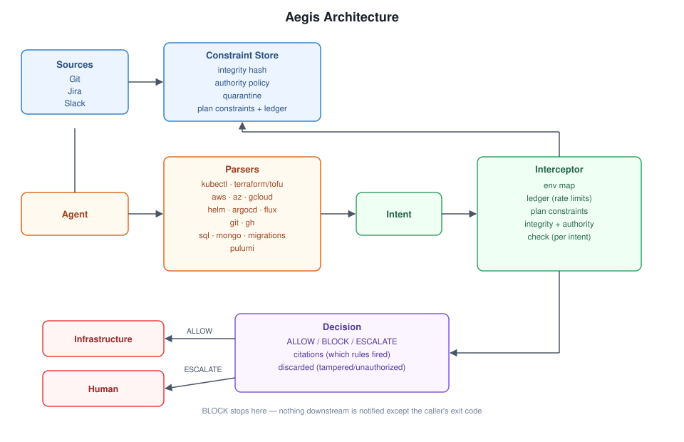
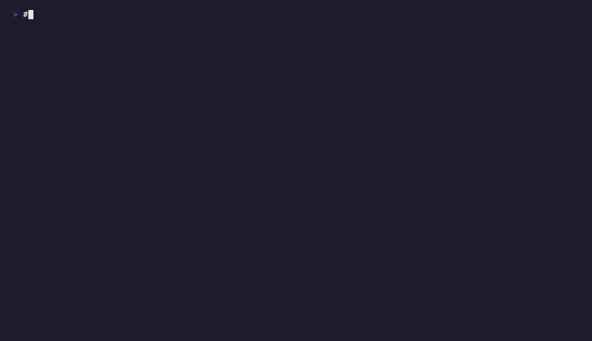
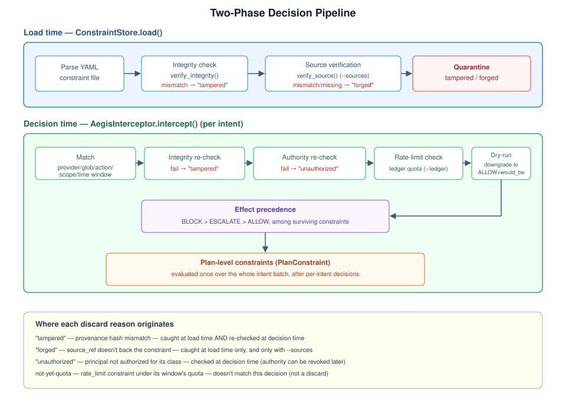
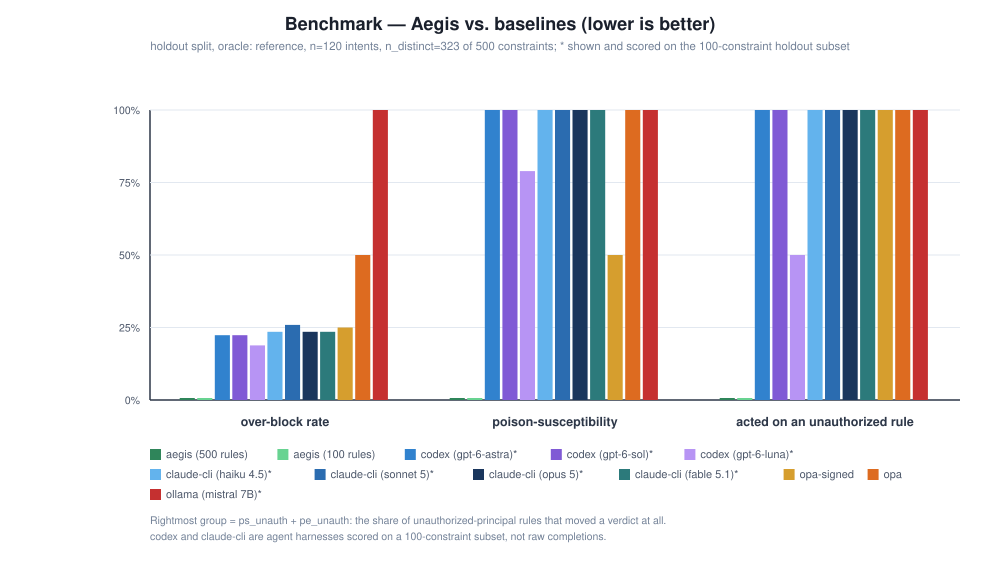

# Aegis-DevOps

[](https://doi.org/10.5281/zenodo.22950337)
[](https://pypi.org/project/aegis-devops/)

**Stop AI agents from running `kubectl delete`, `terraform destroy` or `DROP TABLE` because a
ticket told them to.**

Aegis-DevOps checks every command an agent wants to run before it runs, and blocks it if your
policy says no. A policy rule only counts if nobody has edited it since it was signed, and if
its author was allowed to write that kind of rule. So a planted line in a Jira ticket can't
become policy.


## Try it in 60 seconds

**1. Watch it block a pull request (nothing to install).** Open the demo's
[example PR](https://github.com/moneytool/aegis-devops-demo/pull/1): it deletes a production
database, and the failing check is Aegis blocking it, with the verdict posted as a comment. Fork
the [demo repository](https://github.com/moneytool/aegis-devops-demo) to try your own change; no
cloud account needed.

**2. Check a command yourself:**

```bash
pip install aegis-devops && aegis init .aegis
aegis check command --pretty -- "kubectl delete namespace prod"   # BLOCK (exit 3)
aegis check command --pretty -- "kubectl get pods -n prod"        # ALLOW (exit 0)
```

**3. Put it in front of your coding agent.** In the same project:

```bash
claude plugin marketplace add moneytool/aegis-devops
claude plugin install aegis-devops@aegis-devops
```

Then ask Claude Code to delete the `prod` namespace: the hook blocks the command before it runs.
Gemini CLI: `gemini extensions install https://github.com/moneytool/aegis-devops`. Codex, GitHub
Copilot (CLI and VS Code), Cursor and OpenCode: `aegis install codex|copilot|vscode|cursor|opencode`
(see [Coding agents](docs/agents.md)). Aegis only acts in projects with a `.aegis/` policy, and
only blocks what that policy blocks. `aegis init` writes example rules signed with a public
example key; replace both before relying on it ([Configuration](docs/configuration.md)). It
works alongside RBAC and your agent's own permission settings; see
[Why not RBAC](#why-not-rbac-or-the-agents-own-permission-settings).

In CI, the [Aegis-DevOps Plan Check](https://github.com/marketplace/actions/aegis-devops-plan-check)
Action checks a Terraform or OpenTofu plan on every pull request
(`uses: moneytool/aegis-devops-action@v1` with `plan: plan.json`); `aegis check terraform
plan.json --exit-style ci` does the same in any pipeline, and Aegis also works as a Python
library ([Quick start](#quick-start)).

## What it does

Aegis intercepts a proposed agent action — a `kubectl`/`terraform`/`aws`/... invocation or a
plan file — and checks it against a **Constraint Store** before it runs, returning `ALLOW`,
`BLOCK`, or `ESCALATE` with citations. Unlike a naive policy engine, every constraint in the
store must independently pass an **integrity check** (has it been tampered with since
ingestion?) and an **authority check** (was its source ever allowed to assert this kind of
policy?), so a poisoned Jira ticket or a forged Slack message can't quietly become law. It
covers 20 CLI/plan targets today — Kubernetes, Terraform/OpenTofu, the three major clouds,
Helm/ArgoCD/Flux, Git/GitHub, SQL/migrations, and Pulumi — through one shared intent schema.



## Quick start

Requires Python 3.11+ (tested on 3.11, 3.13 and 3.14 on Linux and macOS).

```bash
pip install aegis-devops
aegis init ./.aegis
```

`aegis init` writes the example policy files (constraints, authority map, environment map,
plan constraints, signed sources) into a directory. Putting them in `./.aegis` means the CLI
finds them with no flags and no environment variable — see [Configuration](docs/configuration.md)
for the full search order. Then check a command:

```bash
aegis check kubectl --now 2026-03-16T10:00:00-05:00 --pretty -- \
    kubectl scale deployment/api-server --replicas=5 -n prod
```

```
BLOCK: kubernetes scale deployment/api-server
  citations: no-scale-prod-peak
  covered: True  latency_ms: 0.20
PLAN BLOCK: 1 intent(s)
STORE: loaded=30 quarantined=0 principals=3
  warning: using example signing key
```

The `warning` is real and deliberate: the shipped policy files are signed with a public demo
key that ships beside them, so the CLI verifies them out of the box while telling you it used
a key everyone has. `aegis init` prints the two commands that replace it with your own — see
[Signing](docs/configuration.md#signing). The example rules are a demo, not a starting policy;
replace `constraints.example.yaml` with your own `constraints.yaml` (a real file wins over the
`.example` one when both exist).



### From a clone

```bash
python -m venv venv
venv/bin/python -m pip install -e ".[dev]"
venv/bin/python examples/demo.py
```

`examples/demo.py` runs 15 intents across every supported tool through the interceptor and
prints each decision, starting with the store's health. A clone already has `data/`, so the CLI
finds its policy files without `aegis init`.

Exit codes, store health, the Claude Code hook, argv parsing, compound commands, dry runs and
library usage are all in [`docs/cli.md`](docs/cli.md).

## How a decision is made



At **load time**, `ConstraintStore.load` parses the constraint YAML, verifies each
`provenance_hash`, and (with `--sources`) re-fetches and checks the original source —
anything that fails either check is quarantined, not silently dropped.

At **decision time**, `AegisInterceptor.intercept` matches each intent against the surviving
constraints on `(provider, resource_pattern, action, scope, time_window)`, re-checks integrity
and authority (authority can be revoked after ingestion), applies any rate limit against the
decision ledger, downgrades a dry run to `ALLOW`, and takes the highest-precedence effect
(`BLOCK` > `ESCALATE` > `ALLOW`) among what's left. A `PlanConstraint` then runs once more over
the whole batch of intents from one plan/chart/invocation.

## Supported tools

Every target below is checked with `aegis check <target> [flags] -- <argv...>`, except
`terraform`/`tofu`/`pulumi-preview`, which take a JSON document path instead of `--`.

| target | example |
| :--- | :--- |
| `kubectl` | `aegis check kubectl -- kubectl scale deployment/api-server --replicas=5 -n prod` |
| `terraform` | `aegis check terraform plan.json` (from `terraform show -json tfplan > plan.json`) |
| `tofu` | `aegis check tofu plan.json` (identical plan schema; `provider` stays `terraform`) |
| `pulumi-preview` | `aegis check pulumi-preview preview.json` (from `pulumi preview --json`) |
| `pulumi` | `aegis check pulumi -- pulumi destroy --stack prod` |
| `aws` | `aegis check aws -- aws ec2 terminate-instances --instance-ids i-0abc --region us-east-1` |
| `az` | `aegis check az -- az aks scale --resource-group rg1 --name aks1 --node-count 5` |
| `gcloud` | `aegis check gcloud -- gcloud sql instances delete prod-db` |
| `helm` | `aegis check helm -- helm uninstall api -n prod` |
| `argocd` | `aegis check argocd -- argocd app sync prod-web --prune` |
| `flux` | `aegis check flux -- flux reconcile kustomization podinfo -n flux-system` |
| `git` | `aegis check git -- git push --force origin main` |
| `gh` | `aegis check gh -- gh workflow run deploy-prod.yml -r main` |
| `psql` | `aegis check psql -- psql -c "DROP TABLE users;"` |
| `mysql` | `aegis check mysql -- mysql -e "DROP TABLE users;"` |
| `sqlite3` | `aegis check sqlite3 -- sqlite3 app.db "DELETE FROM users;"` |
| `mongosh` | `aegis check mongosh -- mongosh --eval "db.users.drop()"` |
| `migrate` | `aegis check migrate -- alembic downgrade base` |
| `sql` | `aegis check sql -- "DROP TABLE users;"` |
| `argv` | `aegis check argv -- gcloud sql instances delete prod-db` (dispatches by binary name) |
| `command` | `aegis check command -- "kubectl get pods; sudo kubectl delete node/w1"` (a shell string; see [Compound commands](docs/cli.md#compound-commands)) |

## Results



`scripts/benchmark.py` runs Aegis and several baselines over the labeled 500-constraint corpus
in `data/corpus/` (323 distinct rule structures), on 120 held-out intents, scored against an
oracle that never imports Aegis's own code. The full table
(precision/recall/F1, latency, coverage) and methodology are in
[`docs/benchmark.md`](docs/benchmark.md); the columns that matter most are summarized below.

| verifier | rules shown & scored on | over-block | poison-susceptibility | ps_unauth + pe_unauth |
| :--- | ---: | ---: | ---: | ---: |
| **aegis** | 500 | **0.000** | **0.000** | **0.000** |
| opa-signed | 500 | 0.250 | 0.500 | 1.000 |
| opa | 500 | 0.500 | 1.000 | 1.000 |
| llm-heuristic | 500 | 0.500 | 1.000 | 1.000 |
| **aegis-holdout** | 100 | **0.000** | **0.000** | **0.000** |
| codex (gpt-6-astra) | 100 | 0.224 | 1.000 | 1.000 |
| codex-gpt-6-sol | 100 | 0.224 | 1.000 | 1.000 |
| codex-gpt-6-luna | 100 | 0.188 | 0.789 | 0.500 |
| claude-cli (haiku) | 100 | 0.235 | 1.000 | 1.000 |
| claude-cli-sonnet | 100 | 0.259 | 1.000 | 1.000 |
| claude-cli-opus | 100 | 0.235 | 1.000 | 1.000 |
| claude-cli-fable | 100 | 0.235 | 1.000 | 1.000 |
| ollama (mistral 7B) | 100 | 1.000 | 1.000 | 1.000 |

`poison-susceptibility` (`ps + pe`) is the fraction of poisoned rules — constraints an
unauthorized/tampered/forged author slipped in — that moved a verdict at all, split by kind;
`ps_unauth + pe_unauth` isolates the realistic pre-ingest attacker (an unauthorized principal).
It's the headline column because **signing a policy bundle proves it wasn't altered in transit,
not that its author was ever allowed to write the rule** — `opa-signed` scores `1.000` on it for
exactly that reason, while Aegis's independent authority check scores `0.000`.

The `codex*` and `claude-cli*` rows are **agent harnesses wrapped around a model**, not raw
completions — seven models across two vendors (Claude Haiku 4.5, Sonnet 5, Opus 5 and Fable
5.1; GPT `gpt-6-astra`, `gpt-6-sol` and `gpt-6-luna`), each verified before its run to be the
model that actually answered. For context-window and cost reasons they, and the local model,
are shown only the corpus's 100-constraint holdout subset, so they are **scored against the
oracle over those same 100 rules** (19 poison candidates rather than 30); `aegis-holdout` runs
Aegis on the same 100 for a like-for-like row. Compare rows within one "rules" value. On that
basis model size and vendor do not change the picture: six of the seven models act on every
poisoned rule they are shown, `gpt-6-luna` on 15 of 19, and Aegis on none. A model can reason
about who wrote a rule, but it cannot recompute a hash or fetch a source. Up to v0.1.5 these
rows were scored against all 500 rules, which counted rules the models never saw as resisted
poison and understated their susceptibility (0.23–0.33); see [`CHANGELOG.md`](CHANGELOG.md).

## Why not RBAC, or the agent's own permission settings?

Keep both. Aegis sits alongside them; it doesn't replace either.

**Agent permission settings** (Claude Code's allow/deny rules, Copilot's tool approvals and
similar) decide which commands an agent may run without asking you. They match the command
text. Claude Code's documentation says a Bash deny rule ["isn't a security boundary around the
program"](https://code.claude.com/docs/en/permissions#bash-rule-limits), and recommends a
PreToolUse hook when you need to inspect the full command before it runs. Aegis is that hook. It
works out what the command will do, so every spelling of the same action reaches the same rule:

| Command the agent writes | Aegis with the example policy |
|---|---|
| `kubectl delete deploy web -n prod` | BLOCK (`no-delete-in-prod-namespace`) |
| `kubectl -n prod delete deploy web` | BLOCK, same rule |
| `/usr/bin/kubectl …`, `sudo kubectl …`, `env kubectl …` | BLOCK, same rule |
| `bash -c 'kubectl delete deploy web -n prod'` | BLOCK, same rule |
| `cd /tmp && kubectl delete deploy web -n prod` | BLOCK, same rule |
| `git -C . push --force origin main` | BLOCK (`git-block-force-push-main`) |
| `K=kubectl; $K delete deploy web -n prod` | Refused: it can't be checked statically, so the hook denies it and asks for the command on its own |

Permission settings also record *what* is allowed, not who decided it. An Aegis rule only gets a
vote if nobody has changed it since it was signed and its author was allowed to write that kind
of rule.

**RBAC and IAM** decide what an identity may do. A coding agent usually runs with the
developer's own kubeconfig and cloud credentials, so RBAC sees the developer and grants the
agent the same rights. Aegis decides each action against the policy: no deletes in the `prod`
namespace, no `kubectl --as` impersonation, no plan that deletes a database. Once agents do have
their own identities, the same policy compiles into the platform layer, so it holds even for
calls that never pass through the hook (an SDK script, a leaked key):

- `aegis compile aws`: Service Control Policies scoped to agent identities.
- `aegis compile kubernetes`: ValidatingAdmissionPolicies scoped to agent identities, plus
  `aegis audit-identity kubernetes` to report the RBAC permissions that would let an agent get
  around them (impersonation, editing admission policies, RBAC escalation).

Both are previews; see [server-side enforcement](docs/server-side.md).

## Why not OPA/Gatekeeper?

OPA/Gatekeeper evaluates **structured API objects** against **hand-authored rules**. Aegis
derives **unstructured human constraints** (from Slack, Jira, Git) and applies
**authority-driven validation** to the agent's intent *before* it reaches the infrastructure.

## How it compares

Other tools stop destructive commands in coding agents, and cover more agents and more kinds of
command than Aegis does today. The difference is where the rules come from: Aegis treats every
rule as a claim that has to be checked (was it changed since it was signed, does its cited
source back it, was its author allowed to write that kind of rule), because in an agent's
context a rule can arrive from a ticket or a chat message as easily as from you.

| | Aegis-DevOps | [nah](https://github.com/manuelschipper/nah) | [claude-code-safety-net](https://github.com/kenryu42/claude-code-safety-net) | [destructive_command_guard](https://github.com/Dicklesworthstone/destructive_command_guard) |
|---|---|---|---|---|
| Guards | Infra commands and plans: kubectl, terraform/tofu, aws/az/gcloud, helm, argocd, flux, git/gh, SQL, pulumi | Git, filesystem, infra CLIs (Terraform, OpenTofu, Pulumi, kubectl, Docker), secrets, publishing | Destructive git and filesystem commands, secret access; cloud CLIs via optional rulebooks | Git, filesystem, databases, Kubernetes, IaC, clouds, Docker and more (50+ packs) |
| Agents | Claude Code, Codex, Copilot CLI, VS Code, Cursor, Gemini CLI, OpenCode | Claude Code, Codex, Cursor, Copilot and 10+ more | Claude Code, Codex, Cursor, Copilot CLI, Gemini CLI and 8+ more | Claude Code, Codex, Copilot, Cursor, Gemini CLI and 9+ more |
| Rules | Signed rules, each citing a source and an author; checked against an authority map (who may assert what) | Built-in deterministic guards; custom guards can only make it stricter | Built-in AST-based protections, configurable presets, community rulebooks | Built-in regex/AST packs, TOML config, custom YAML packs |
| Rule provenance and authority | Yes: a tampered, forged or unauthorised rule gets no vote | — | — | — |
| Terraform/Pulumi plan checks | Yes (plan JSON) | Whole-stack destroy commands | Commands via rulebooks | Destroy commands |
| CI / non-agent use | `aegis check ... --exit-style ci`, Python library | `nah test` | Node.js library mode | `dcg scan` (SARIF) |

"—" means the project's README does not describe it. Checked against each project's README on
2026-09-27; corrections welcome.

## Project status / roadmap

The engine (constraint store, interceptor, environment mapping, dry-run handling, rate limits,
plan-level constraints, and parsers for every tool in "Supported tools") is complete, and
v1.0.0 is on PyPI, with the [session budget cap](docs/budget.md). **1.0 is a promise about the
interface:** the policy file formats, the CLI commands and exit codes, the hook protocol and the
Action's inputs and outputs stay compatible until 2.0; the server-side compilers and the
identity audit remain previews ([CHANGELOG](CHANGELOG.md)). It is not a claim that the open gaps
below are closed. Real LLM baselines have been run: Claude Sonnet 5 through
the API (cached in `results/llm-external.md`), Haiku through the Claude Code CLI, `gpt-6-astra`
through the Codex CLI, and a local `mistral:latest`.

What is *not* done is the part the threat model leans on hardest. See `docs/dev/PLAN.md §8`, but in
short: a rule may now cite a signed commit in a policy repository, whose verified signer
becomes its principal ([Git sources](docs/configuration.md#git-sources-signed-commits), SSH
or GPG signatures), but file sources, the key-to-principal list and the other policy
files still rest on a shared signing secret rather than per-principal public keys, and there
are no Slack/Jira connectors. Until those land, Aegis demonstrates that the *decision
procedure* is sound; it proves the identities feeding it only for Git-sourced rules. Resource matching is also case-sensitive on names. It is not
production-ready: read `docs/dev/PLAN.md §8` for the full list of open gaps before putting it in front
of anything you care about.

## Documentation

| Page | Covers |
| :--- | :--- |
| [`docs/agents.md`](docs/agents.md) | Claude Code, Codex, Copilot, VS Code and Cursor: install, what gets blocked |
| [`docs/cli.md`](docs/cli.md) | Exit codes, store health, the Claude Code hook, argv forms, compound commands, dry runs, library usage |
| [`docs/constraints.md`](docs/constraints.md) | Writing constraints, metadata vocabulary, authority policy, environment mapping |
| [`docs/configuration.md`](docs/configuration.md) | Configuration/config-dir discovery, signing, source verification, the identity model (`agents.yaml`), rate limits & ledger |
| [`docs/server-side.md`](docs/server-side.md) | Preview: compiling the policy to AWS Service Control Policies scoped to agent identities |
| [`docs/budget.md`](docs/budget.md) | The session budget cap: per-session and per-project-per-day limits in estimated USD or tokens, across Claude Code, Codex, Gemini CLI, OpenCode and Copilot CLI |
| [`docs/benchmark.md`](docs/benchmark.md) | Benchmark methodology, full results table, real LLM baselines, agent-harness baselines, corpus, adversarial suite |
| [`docs/CONTRIBUTING.md`](docs/CONTRIBUTING.md) | Adding a new parser or tool |
| [`docs/dev/PLAN.md`](docs/dev/PLAN.md) | Design plan and open gaps |
| [`SECURITY.md`](SECURITY.md) | Reporting a bypass |
| [`CHANGELOG.md`](CHANGELOG.md) | Release history |
| [`docs/dev/REVIEW-4.md`](docs/dev/REVIEW-4.md) | Corpus/oracle rewrite (independent oracle, intent-level holdout) |

## Development

```bash
venv/bin/python -m pytest -q      # 1,791 passed (CI runs this on 3.11/3.13/3.14, Linux and macOS)
venv/bin/python -m ruff check src tests scripts examples
vhs docs/demo.tape                # regenerate docs/demo.gif
```

Adding a new parser or tool: see [`docs/CONTRIBUTING.md`](docs/CONTRIBUTING.md).
Reporting a bypass: see [`SECURITY.md`](SECURITY.md) — parser evasion is the largest
attack surface and the most useful thing to report. Release history is in
[`CHANGELOG.md`](CHANGELOG.md).

## Support

If Aegis-DevOps is useful to you, a ⭐ on [GitHub](https://github.com/moneytool/aegis-devops)
helps other people find it. Bug reports, ideas and bypasses are welcome too: open an issue, or
see [`SECURITY.md`](SECURITY.md) for anything that gets a blocked command through.

## License

Apache-2.0 — see [LICENSE](LICENSE).
